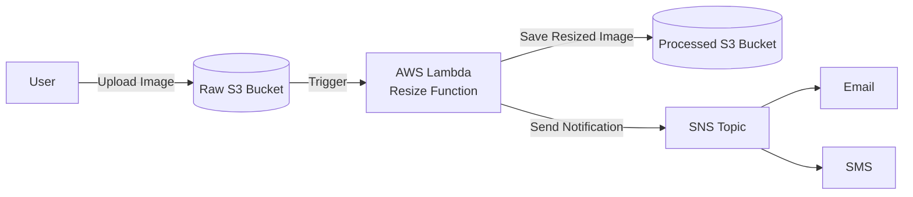

# Automated Image Resizing and Transfer System Using AWS Services

🏷️ Project Type: AWS Serverless Architecture • DevOps • Cloud Automation

## 1. Introduction
   
The Automated Image Resizing and Transfer System is a serverless, event-driven architecture built on AWS that processes images in real-time upon upload. It automatically resizes, optimizes, and stores images while providing real-time notifications to stakeholders.

This system is designed for:

✔ E-commerce platforms (product image thumbnails)

✔ Social media apps (user-generated content processing)

✔ Enterprise document management (PDF/JPEG optimization)

✔ Media companies (batch image processing pipelines)

## 2. Core Objectives
Automate Image Processing – Eliminate manual resizing and conversion

Ensure Cost Efficiency – Use serverless components to minimize expenses

Maintain Security – Encrypt data, enforce least-privilege access

Scale Seamlessly – Handle spikes in uploads without downtime

## 3. System Architecture
   
### 3.1 High-Level Workflow
  - Upload Trigger

    - A user uploads an image to an S3 bucket (raw-images-bucket)

   - Event-Driven Processing

     - S3 triggers an AWS Lambda function

  - Image Transformation

     - Lambda resizes the image using Pillow (Python)

   - Storage & Organization

     - Processed images are saved in another S3 bucket (processed-images-bucket)

  - Notification

    -  Amazon SNS sends an email/SMS alert upon completion

### 3.2 Detailed Component Breakdown
🔹 Amazon S3 (Simple Storage Service)

   - Raw Images Bucket
     - Accepts user uploads (JPEG, PNG, WebP)
     - Enforces server-side encryption (SSE-S3)
     - Lifecycle rule: Auto-deletes raw images after 7 days
   - Processed Images Bucket
      - Stores resized images in /thumbnails/, /medium/, /full/ paths
      - Uses S3 Intelligent-Tiering for cost savings

🔹 AWS Lambda (Serverless Compute)

   - Runtime: Python 3.12
   - Memory: 1024MB (adjustable based on image size)
   - Timeout: 10 seconds (optimized for fast processing)
   - Key Features:
     
     - Dynamic resizing (configurable dimensions via metadata)
     - Supports batch processing (multiple resolutions in one pass)
     - Error handling (retries failed operations)

🔹 Amazon SNS (Simple Notification Service)

  - Topics:

    - `ImageProcessingSuccess` (for completed jobs)
    - `ImageProcessingErrors` (for failures)

  - Subscribers:

    - Email (team@company.com)
    - SMS (for urgent failures)

🔹 AWS IAM (Identity & Access Management)

   - Least Privilege Roles:
     - Lambda can only read from raw-images-bucket
     - Lambda can only write to processed-images-bucket
     - Lambda can publish to SNS topics

## auto-image-resizer-architecture :


## 📐 Architecture Diagram

## 🔧 Prerequisites  
- AWS Account with IAM permissions  
- AWS CLI configured (`aws configure`)  
- Python 3.8+ (for Lambda)  

## 🛠️ Deployment  
### Manual Setup (AWS Console)  
1. **Create S3 Buckets**:  
   ```bash  
   aws s3api create-bucket --bucket raw-images-[yourname]  
   aws s3api create-bucket --bucket processed-images-[yourname]

2.Deploy Lambda:
  - ZIP your Python code (`lambda_function.py `+ `Pillow` layer)
  - Set trigger: S3 `PutObject` on the raw bucket

3. Usage Example
## 📸 How to Use 
1. Upload an image:  
   ```bash  
   aws s3 cp cat.jpg s3://raw-images-[yourname]

#### **4. Customization**

```markdown
## ⚙️ Customize Resizing Logic  
Edit `lambda_function.py`:  
```python  
def resize_image(image_path):  
    # Change dimensions here  
    with Image.open(image_path) as img:  
        img.thumbnail((800, 800))  # 👈 Adjust as needed
```

5. Cleanup (Avoid AWS Charges)

   ```
   aws s3 rb s3://raw-images-[yourname] --force
   aws lambda delete-function --function-name image-resizer
   ```


## 🎉 **It Works!**  
✅ **Image Resized Perfectly**  
✅ **Instant Notification Received**  

### 🖼️ **Sample Output**  

## Original

## Resized (Thumbnail)

## Notification


### 🚀 **Try It Yourself**  
1. Upload any image:  
   ```bash  
   aws s3 cp your-image.jpg s3://your-raw-bucket

## 🔍 How We Verified Success

1. S3 Check:

    `aws s3 ls s3://processed-bucket/thumbnails/ --human-readable`

  - Output:

    `2024-05-20 12:34:56    45.2 KB cat_thumbnail.jpg`

2. CloudWatch Logs:

   `aws logs filter-log-events --log-group-name "/aws/lambda/resizer" \  
--filter-pattern "SUCCESS" --max-items 1`

   - Output:
     
     `{ "message": "SUCCESS: Resized cat.jpg → thumbnail (200x200)" }`

3. SNS Proof:

     - 📲 SMS Received:
   
         "Image processed: cat.jpg → View at` s3://processed-bucket/thumbnails/cat.jpg"  `
